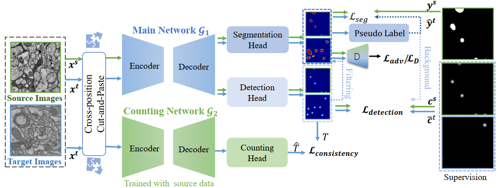

---

---

# WDA-Net: Weakly-Supervised Domain Adaptive Segmentation of Electron Microscopy

This repository is the work of  "WDA-Net: Weakly-Supervised Domain Adaptive Segmentation of Electron Microscopy" based on pytorch implementation. 

## Architecture of WDA-Net 

The code will be made public soon.