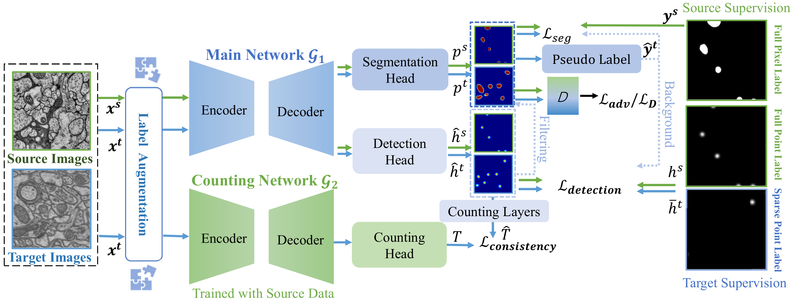

# Weakly-Supervised Cross-Domain Segmentation of Electron Microscopy with Sparse Point Annotation <br/> for Adapting Semantic Segmentation
[](https://opensource.org/licenses/Apache-2.0)
[](https://pytorch.org/)

This repository contains the official implementation of our paper:

## Introduction
[**Weakly-Supervised Cross-Domain Segmentation of Electron Microscopy with Sparse Point Annotation**](https://ieeexplore.ieee.org/abstract/document/10473097),<br>
In: *IEEE TRANSACTIONS ON BIG DATA,2024*<br>
[[arXiv](https://arxiv.org/pdf/2404.00667.pdf)]




## Installation
**Requirements.** To reproduce our results, we recommend Python >=3.6, PyTorch >=1.4, CUDA >=10.0. At least one GPU with a minimum of 11GB memory is required for training.


1. Create conda environment:
```
conda create --name wda-net
source activate wda-net
```

2. Install PyTorch >=1.4 (see [PyTorch instructions](https://pytorch.org/get-started/locally/)). For example,

```
conda install pytorch torchvision torchaudio cudatoolkit=10.2 -c pytorch
```

3. Install the dependencies:
```
pip install -r requirements.txt
```

4. Download data ([VNC](https://github.com/unidesigner/groundtruth-drosophila-vnc/tree/master/stack2/raw), [EPFL](https://www.epfl.ch/labs/cvlab/data/data-em//) and create symlinks in the ```./data``` folder, as follows:

```
./data/50%vncdata -> <symlink to VNC>
./data/50%vncdata/train/img
./data/50%vncdata/train/lab

./data/cvlabdata -> <symlink to EPFL>
./data/cvlabdata/train/img
./data/cvlabdata/train/lab
./data/cvlabdata/train/15%_split1
./data/cvlabdata/test/img
./data/cvlabdata/test/lab

```

**Tip:** We provide labels with 15% center points in target domain. You can download the data:
[15%_split1](https://drive.google.com/drive/folders/1D9TKm7Wo6ohX3AmjZSmo4m4cl7Lb6v_Z)


## Training 


0.Run the count model (Source domain: VNC)
```
python 00_count_main.py
```
If you would like to skip this step, you can use our pre-trained models:
[vnc_count.pth](https://drive.google.com/drive/folders/1ippr-tdam7SjBSm6-NgSb0bMqx0WH1Tr),
**Tip:** You can download the file and create symlinks in the ```./pretrain_model``` folder, as follows: ```./pretrain_model/vnc_count.pth```:

1.Run the pretrained model (Source domain: VNC)
```
python 00_Full-Supervised.py
```
If you would like to skip this step, you can use our pre-trained models:
[vnc_full_supervised.pth](https://drive.google.com/drive/folders/1ippr-tdam7SjBSm6-NgSb0bMqx0WH1Tr), 
**Tip:** You can download the file , as follows: ```./pretrain_model/vnc_full_supervised.pth```:

2.Run the detection model (Target domain: EPFL)
```
python 01_stage1_vnc.py
```

3.Run the segmentation model (Target domain: EPFL)
```
python 02_stage2_vnc.py
```

## Inference

Run single-scale inference from your model
```
python evalue_segmentation.py
```
You can use our pre-trained model:
[inference.pth](https://drive.google.com/drive/folders/1ippr-tdam7SjBSm6-NgSb0bMqx0WH1Tr) 


## Citation
We hope you find our work useful. If you would like to acknowledge it in your project, please use the following citation:

```
@article{qiu2024weakly,
  title={Weakly-Supervised Cross-Domain Segmentation of Electron Microscopy with Sparse Point Annotation},
  author={Qiu, Dafei and Xiong, Shan and Yi, Jiajin and Peng, Jialin},
  journal={IEEE Transactions on Big Data},
  year={2024},
  publisher={IEEE}
}
```